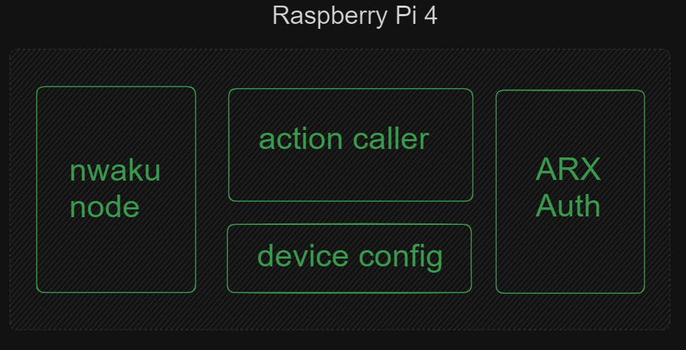
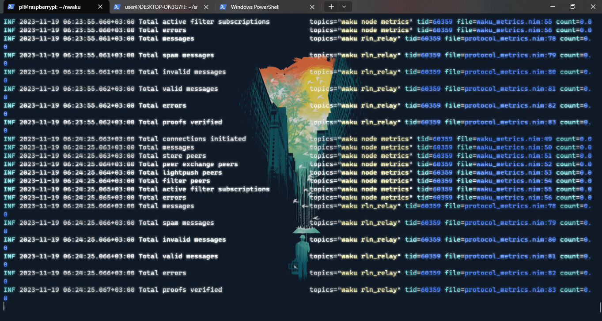

# SMART NeSt - IoT Smart Home Infrastructure for Self-Organized Network State Communities


## User flow of the solution


## Breakdown of Raspberry Pi services 


Waku node running on the raspberry pi from binary that was built from scratch.


## Overview

SMART NeSt is an Internet of Things (IoT) smart home infrastructure designed for self-organized communities, also known as network states. This project aims to provide a robust and scalable solution for creating smart homes that are interconnected within a community, fostering collaboration, sustainability, and efficient resource management.

## Key Features

ToDo

## Physical Nodes with Raspberry Pi

SMART NeSt consists of physical Raspberry Pi nodes strategically placed within the community. These nodes serve as the backbone of the infrastructure, facilitating communication between devices thanks to Waku and ensuring a reliable decentralization.

## Getting Started

### Prerequisites

- Get at least 1 Raspberry Pi
- Bott the device with Ubuntu
- Install gcc and Rust toolchain
- git clone nwaku and compile it according to instructions
- configure nwaku for selected community by specifying `content topic`
- run nwaku

### Installation quickstarts for mobile dapp

1. Clone this repo & install dependencies

```
git clone https://github.com/JustAnotherDevv/SMART-NeS.git
cd scaffold-eth-2
yarn install
```

2. Run a local network in the first terminal:

```
yarn chain
```

This command starts a local Ethereum network using Hardhat. The network runs on your local machine and can be used for testing and development. You can customize the network configuration in `hardhat.config.ts`.

3. On a second terminal, deploy the test contract:

```
yarn deploy
```

This command deploys a test smart contract to the local network. The contract is located in `packages/hardhat/contracts` and can be modified to suit your needs. The `yarn deploy` command uses the deploy script located in `packages/hardhat/deploy` to deploy the contract to the network. You can also customize the deploy script.

4. On a third terminal, start your NextJS app:

```
yarn start
```

Visit your app on: `http://localhost:3000`. You can interact with your smart contract using the `Debug Contracts` page. You can tweak the app config in `packages/nextjs/scaffold.config.ts`.
